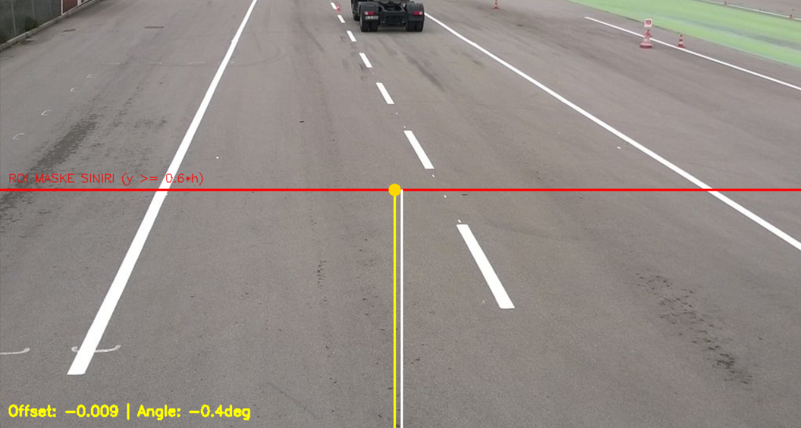
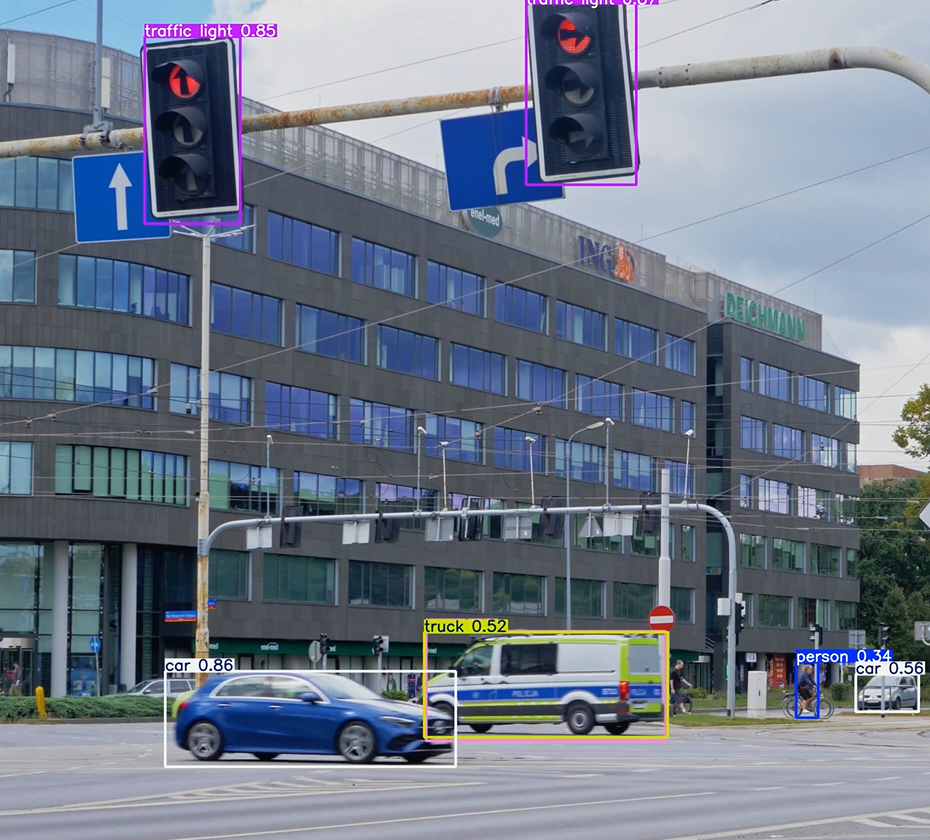
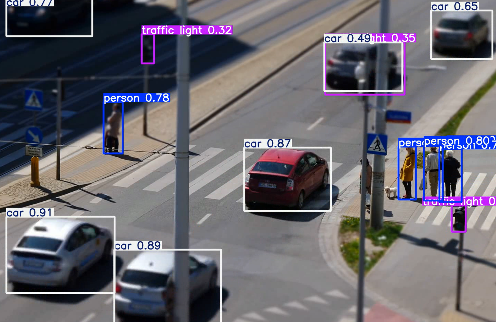

# Robotaksi Autonomous Perception

A computer vision-based perception system developed for the **TEKNOFEST Robotaksi Passenger Autonomous Vehicle Competition**.

The system combines classical computer vision and YOLO-based object detection to process camera images and provide lane information, road-object detection, and safety-related outputs.

## Project Overview

The perception pipeline takes a camera frame as input and produces structured perception data for an autonomous driving system.

The system combines:

* **Lane detection** using OpenCV
* **YOLO-based object detection**
* **Traffic sign and traffic light processing**
* **Obstacle detection**
* **Safety and speed logic**
* **ROS integration**

## Perception Pipeline

```text
                       Camera Image
                            │
                            ▼
                   Perception Pipeline
                      ┌─────┴─────┐
                      │           │
                      ▼           ▼
                Lane Detection   YOLO
                      │           │
                      │       ┌───┴──────────────┐
                      │       │                  │
                      ▼       ▼                  ▼
                Lane Offset  Road Signs      Obstacles
                Lane Angle  Traffic Lights   Vehicles
                      │       │                  │
                      └───────┴──────────────────┘
                                  │
                                  ▼
                          Safety & Speed Logic
                                  │
                                  ▼
                          Structured Output
                                  │
                                  ▼
                            ROS Interface
```

## Features

### Lane Detection

The lane detection module uses classical computer vision techniques:

* Region of Interest (ROI) selection
* HSV color filtering
* White and yellow lane masking
* Gaussian blur
* Canny edge detection
* Hough Line Transform
* Left and right lane separation
* Lane center estimation
* Temporal smoothing

The region of interest focuses on the lower part of the camera image where lane markings are expected.

The module provides:

```text
lane_center
lane_offset
lane_angle
```

The lane offset is normalized relative to the center of the camera frame and is also used by the speed logic.

### YOLO Object Detection

The project uses a trained YOLO model located at:

```text
models/best.pt
```

The dataset contains **21 classes** related to road signs, traffic lights, and road environments.

Dataset classes include:

```text
bus_stop
do_not_enter
do_not_stop
do_not_turn_l
do_not_turn_r
do_not_u_turn
enter_left_lane
green_light
left_right_lane
no_parking
parking
ped_crossing
ped_zebra_cross
railway_crossing
red_light
stop
t_intersection_l
traffic_light
u_turn
warning
yellow_light
```

The dataset was prepared using Roboflow.

### Traffic Sign Processing

The perception pipeline processes supported traffic sign classes and includes safety handling for stop signs.

For example:

```text
STOP → Emergency Stop
```

### Traffic Light Processing

Detected traffic light regions are processed to estimate their current state.

The output can be:

```text
red
yellow
green
none
```

A detected red light can trigger the emergency-stop logic.

### Obstacle Detection

The perception pipeline detects supported road obstacles such as:

* Person
* Car
* Bicycle

Detected objects are returned with their:

* Class
* Bounding box
* Confidence score

Objects entering the lower region of the image can trigger the emergency-stop logic.

## Application Results

The following examples show outputs from the perception system during testing.

### Lane Detection

The lane detection module estimates the lane center and calculates the vehicle's lateral offset from the detected lane.



### Object Detection

The YOLO-based perception system detects road objects and traffic-related elements from camera images.





## Safety Logic

The perception system combines multiple perception results to generate safety-related outputs.

An emergency stop can be triggered by:

* A detected stop sign
* A red traffic light
* A close obstacle

The system also maintains a short temporal safety memory. When an emergency condition is detected, the emergency state remains active for several processing cycles instead of immediately disappearing in the next frame.

The final speed value is influenced by traffic-related conditions and the vehicle's position relative to the detected lane.

## ROS Integration

The project includes a ROS perception node that receives camera images and publishes structured perception results.

### Input

```text
/camera/image_raw
```

Camera images are converted from ROS messages to OpenCV images using `CvBridge`.

### Outputs

```text
/perception_output
/emergency_stop
/speed_cmd
```

The main perception output is published as a JSON string containing:

```text
lane
traffic_signs
traffic_light
obstacles
emergency_stop
speed
```

Example:

```json
{
  "lane": {
    "offset": 0.02,
    "angle": 0.9
  },
  "traffic_signs": [],
  "traffic_light": {
    "state": "none"
  },
  "obstacles": [],
  "emergency_stop": false,
  "speed": 0.98
}
```

## Project Structure

```text
robotaksi-autonomous-perception/
│
├── config/
│   └── data.yaml
│
├── images/
│   ├── lane-detection.png
│   ├── object_detection_1.png
│   └── object_detection_2.png
│
├── models/
│   └── best.pt
│
├── src/
│   ├── lane.py
│   ├── main.py
│   ├── perception.py
│   └── ros_node.py
│
├── README.md
└── requirements.txt
```

### File Descriptions

| File                | Description                                     |
| ------------------- | ----------------------------------------------- |
| `src/lane.py`       | Lane detection using OpenCV                     |
| `src/perception.py` | Main perception pipeline and safety logic       |
| `src/main.py`       | Local camera/video execution                    |
| `src/ros_node.py`   | ROS camera subscriber and perception publishers |
| `models/best.pt`    | Trained YOLO model                              |
| `config/data.yaml`  | YOLO dataset configuration                      |
| `requirements.txt`  | Python dependencies                             |

## Technologies

* Python
* OpenCV
* NumPy
* Ultralytics YOLO
* ROS
* CvBridge
* Roboflow

## Installation

Clone the repository:

```bash
git clone https://github.com/azradrnn/robotaksi-autonomous-perception.git
cd robotaksi-autonomous-perception
```

Install the required Python packages:

```bash
pip install -r requirements.txt
```

The trained YOLO model is included in:

```text
models/best.pt
```

## Local Usage

The perception pipeline can be tested using a webcam or a video file.

From the project root:

```bash
python src/main.py
```

To use a video file:

```bash
python src/main.py path/to/video.mp4
```

The processed frames are displayed in an OpenCV window.

Press `q` to exit.

## ROS Usage

The ROS node can be started in a configured ROS environment:

```bash
python src/ros_node.py
```

The node subscribes to:

```text
/camera/image_raw
```

and publishes perception and safety information through the corresponding ROS topics.

## Dataset

The YOLO dataset was prepared using Roboflow and contains 21 road-related classes.

Dataset configuration:

```text
Train: dataset/train/images
Validation: dataset/valid/images
Test: dataset/test/images
```

The dataset configuration references a dataset released under the **CC BY 4.0** license.

## My Role — Perception Lead

As the **Perception Lead**, my work focused on developing and integrating the perception components of the autonomous vehicle system.

Key responsibilities included:

* Developing lane detection using HSV filtering, Canny edge detection, and Hough Line Transform
* Working on YOLO-based detection for road signs, traffic lights, and obstacles
* Preparing and working with perception datasets using Roboflow
* Developing safety logic based on detected road conditions
* Integrating perception outputs with the ROS-based system
* Testing perception components in the autonomous driving simulation environment

## Competition

This project was developed as part of the **TEKNOFEST Robotaksi Passenger Autonomous Vehicle Competition**.

The system was designed for an autonomous driving scenario where perception information supports vehicle navigation and safety decisions.

## License

The dataset configuration references a dataset released under the **Creative Commons Attribution 4.0 (CC BY 4.0)** license.

Project code is provided for educational and competition purposes.

